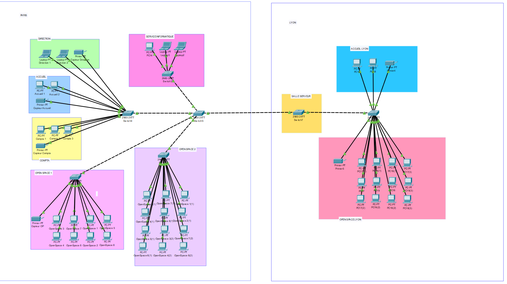

# Projet Cisco Packet Tracer - Réseau LAN Paris Lyon

## Objectif

Création d’une topologie réseau simple sous Cisco Packet Tracer.

## Topologie

## Fichier Packet Tracer

Le fichier `.pkt` est disponible ici :

[Télécharger le projet Packet Tracer](challenge-reseau-01.pkt)

## Équipements utilisés

- Routeur
- Switch
- PC clients
- Câblage Ethernet

## Compétences travaillées

- Création d’une topologie réseau
- Configuration IP
- Connexion des équipements
- Test de connectivité avec `ping`
